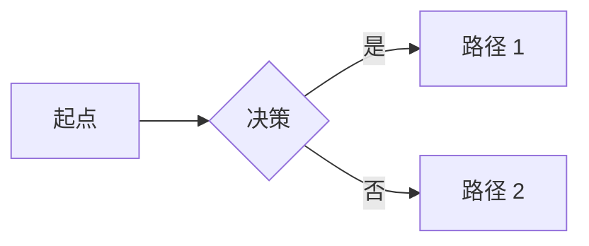

## 定义

**Mermaid** 是一种基于文本的图表生成语法（文本 DSL）。用户通过类似代码的简单语法描述图表，工具自动渲染为 SVG。Mermaid 被广泛集成在 GitHub、Notion、[[Obsidian]] 等平台。

## 核心特性

- **文本驱动**：用代码而非鼠标拖拽创建图表
- **版本可控**：图表存为文本，可被 Git 跟踪
- **图表类型丰富**：流程图、时序图、甘特图、类图、状态图、ER 图等
- **AI 友好**：大模型容易生成正确的 Mermaid 代码

## 在 Obsidian 中的使用

Obsidian 原生支持 Mermaid。在 Markdown 中使用代码块：

````markdown

````

## 作为 [[Agent_Skill|Agent Skill]]

[[Axton]] 开发了 Mermaid Skill，让智能体生成的 Mermaid 代码：

- **结构清晰**：自动选择合适的图表类型
- **样式美观**：合理的颜色与布局
- **成功率高**：几乎不需要手动调试

## 适用场景

| 场景 | Mermaid 适配度 |
|------|----------------|
| 流程图 / 决策树 | ⭐⭐⭐⭐⭐ |
| 时序图（API 调用） | ⭐⭐⭐⭐⭐ |
| 类图（UML） | ⭐⭐⭐⭐ |
| 甘特图（项目计划） | ⭐⭐⭐⭐ |
| 头脑风暴 / 思维导图 | ⭐⭐ |
| 自由绘图 | ⭐ |

## 与其他绘图方案对比

| 工具 | 输入方式 | 优势 |
|------|----------|------|
| Mermaid | 文本 DSL | 易版本控制、AI 友好 |
| [[Excalidraw]] | 鼠标手绘 | 头脑风暴、视觉亲和 |
| JSON Canvas | 拖拽节点 | 知识架构、原生 Obsidian |

## 关联连接

- [[Axton]] — Mermaid Skill 作者
- [[Obsidian]] — 原生支持 Mermaid 的母平台
- [[Excalidraw]] — 替代方案
- [[Agent_Skill]] — Skill 标准
- [[摘要-obsidian-9-essential-agent-skills]] — 来源
